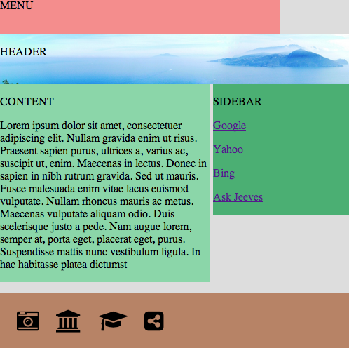

@annotation:tour intro
#More Advanced Layouts
This module builds on the materials we learnt in the 'My First Web Page' module.

We will learn how to flow logical blocks of content that can change as the browser resizes.

The image below shows what we will be building. 



It is not especially pretty, but we want to concentrate on the basics and not spend too much time on details. In the next module, we will be building something much prettier.

@annotation:tour experiment
#Experiment
As with all Codio modules, we strongly encourage you to experiment as you go. You should hack the `index.html` and `main.css` files about without fear.

If you mess something up, you can restore the code by selecting the relevant item from the Rocket menu.


@annotation:tour raw
#Starting point
You can select 'Starting Out' from the Rocket menu to load the correct code for this section.

Open up `index.html` and take a look at it. Preview it to see some very plain output.

There's not a lot to say here, so in the next section we'll add some basic CSS.

@annotation:tour colors
#Adding some colors
Select 'Colors' from the Rocket menu to load the correct code for this section.

We haven't really changed the HTML other than to reference the CSS file, which you should have a look at and then preview.

##Visualizing our blocks
By adding some basic CSS colors, we can now easily see each <div> block.

You should notice is that our main <div> elements are all contained within one *parent* <div>. That parent we have given a light gray background.

###Recap
A <div> is nothing other than a *block* level container whose purpose is

- to contains further HTML elements
- to get styled

##Div behavior
A <div> has the following behavior

- it will expand horizontally to fill its parent container unless a width is specified in the CSS (which we have not done here yet)
- it will expand vertically just enough to contain its child elements, which in our case are just <p> elements with some text to identify the container

Make sure you can see this in the preview.

The reason that the <div class='main'> does not fill the entire width of the screen is that the browser has some default padding. You can override this in your CSS of course. 

If you add the snippet shown below to the top of your CSS, you'll can see how you can get rid of the browser's default margin and paddings. Experiment by previewing after 

- changing values
- using just `body` or just `p` 

```
body, p {
    margin: 0;
    padding: 0;
}
```

@annotation:tour sizing
#Sizing our containers
Select 'Sizing' from the Rocket menu to load the correct code for this section.

If you preview, you can now see something more interesting starting to happen. Let's run through what we've done.

##Nicer HTML Tags
You'll notice that rather than using <div>s for all containers, we've actually taken advantage of some standard HTML tags that are provided for standard elements.

You don't *have* to use these, you can still use <divs> but the advantage is that it makes your code more readable and you don't have to use classes. To all intents and purposes, though, they behave like <divd>s.

- <nav> - is used for navigation menus
- <header> is used for a pages header section
- <footer> is pretty obvious

There are several other *semantic* elements offered by HTML, namely <section>, <article>, <aside>, <figure>, <figcaption>, <details>, <summary>, <mark>, <time>

##Added some content
We've added some text to the 'Content' container. This is done in the HTML.

We've also added in a few links to the 'Sidebar' container. Take a look at the HTML to see how links are set up.

##Sizing the menu
The menu now has a fixed size. This is done in the CSS (take a look at the <nav> selector) and in our case we've set the width to 400 pixels.

##Sizing the Content and Sidebar containers
We really want our Content and Sidebar containers to live side by side. Although they don't yet appear correctly (which we'll correct in the next section) we want 

- the Content to occupy 60% of the width
- the Sidebar to occupy 40% of the width

Next, we'll get them the appear side by side.


@annotation:tour float
#Floating the containers
Select 'Floating' from the Rocket menu to load the correct code for this section.

What happens next is actually quite tricky to understand. It is, without doubt, best understood by experimentation. So, once you've read the explanations, experiment like crazy with the CSS settings until you feel you understand it.

##A <div>'s natural flow
A <div> is a *block* level container. 

- It takes up the full width of its parent container
- It is a part of the natural flow of the document. This means it will be positioned underneath the previous block level element (<div>s in our case).

In the previous section we saw how the Content and Sidebar <div>s display underneath each other, even though we set the width properties.

To get them to appear side by side, we need to use a special CSS property called 'float'. If you look at `main.css` you can see that we have the following 

```
.content {
  background-color: #8bd6a9;
  width: 60%;
  float: left;  
}

.sidebar {
  background-color: #4baf73; 
  width: 35%; 
  float: right;
}
```

##What does 'float' do then?
The key thing that float does is to *remove the floated element from the normal block flow* and then *position the floated element usually to the left or right of the page*.

The problem with removing a block from the normal document flow is that subsequent *unfloated* blocks will appear in the normal document flow and will be display beneath the last unfloated block element.

##Looking at our page
Take a look at the preview of our page. 

- Menu and Header are unfloated blocks and so appear obediently beneath one another. 
- Content and Sidebar are floated and so imagine they are not even there
- The next unfloated block is the Footer. This will, and does, appear beneath the Header block. You can actually see its brown background sticking out below the Header block. We actually set the width of the Sidebar <div> to be 35% so we could see this happening. If we set it to 40%, it woulc be completely hidden from view.
- The reason that the text 'FOOTER' appears messily beneath the Sidebar is that the browser needs to show it and this is the earliest place on the page that it can fit.

@annotation:tour clear
#Clearing this problem
To make everything appear as it should be, we need to understand the CSS `clear` property.

The `clear` CSS property specifies whether an element can be next to floating elements that precede it or must be moved down (cleared) below them.

The clear property applies to both floating and non-floating elements.

When applied to non-floating blocks (in our case the Header <div>), it moves the border edge of the element down until it is below the margin edge of all relevant floats (in our case the Content and Sidebar <div>s).

So, you should go to `main.css` and change from this

```
footer {
  background-color: #b78366;   
  height: 80px;  
}
```

to this

```
footer {
  clear: both;
  background-color: #b78366;   
  height: 80px;  
}
```

Now run preview and all will be well with our page. If you like, you can restore the width of the Sidebar to 40%. 


@annotation:tour expfloat1
#Experiment
Experiment a little, for example by 

- removing or changing the float properties
- changing widths
- playing with the `clear` property

Really hack it about. You can always restore to its original state by selecting 'Floating' from the Rocket menu.

@annotation:tour experimentfloat
#Another float experiment
Select 'Float Play' from the Rocket menu.

You now have another project that should help you reinforce things using simple blocks.

When you preview, you'll see that Blocks 3 and 4 overlap one another. We covered the solution to this in the previous section (remember `clear: both`?).

Looking at the HTML, you can see that each block has its own ID and we've created selectors in the CSS for each of these. Go ahead and make changes with `float`, `width` and any other properties you want to modify.


